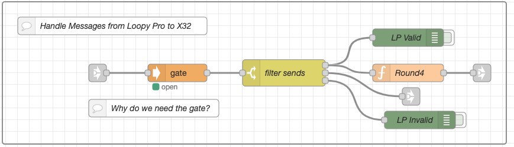

# Connecting an X32 (or XR18) to Loopy Pro

## An Overview

If all I wanted to do was get audio in and out of Loopy Pro, I just needed to connect the mixer to a USB dongle and then connect the dongle to the iPad. I'm running Loopy Pro on a 2024 iPad Air M2 so the USB connection is USB-C. I'm using a UtechSmart USB-C hub that also has HDMI and Ethernet. More on that later. Behringer mixers are Core Audio compliant so they just "show up" as audio INs and OUTs on the iPad.

Of course, that didn't provide any type of control over the mixer so I soon started trying to figure out how to control the mixer from Loopy Pro. Since Behringer mixers use OSC for control, and Loopy Pro supports OSC, I thought this would be simple, but that was not the case.

Loopy Pro uses a TCP network connection for OSC and the X32 uses a UDP connection. In addition, the mixer needs to be periodically sent a "/xremote" command to subscribe to updates from other devices, specifically the faders and buttons on the X32 itself.  There needed to be a man-in-the-middle to bridge the network connections and also to handle the flow of messages between Loopy Pro and the X32 and visa versa.

Why does the title say "or XR18"? Well, because there's a lot of overlap in the OSC commands between the X32 and XR18 mixers, so what I'm describing here should work with both mixers.  **Note that the XR16 and XR12 DO NOT have USB audio interfaces so they cannot be connected to Loopy Pro.**

## Enter the Raspbery Pi running Node-RED (as the man-in-the middle)

The Raspberry Pi has long been considered the Swiss Army knife of computing and when running a low-code tool called Node-RED, it can be insanely powerful. I'm not going to go into imaging a Pi nor am I going to get into installing Node-RED on the Pi since there's plenty of how-tos and tutorials on doing this. There's even a bash shell script that does the whole thing for you. I will however mention that, in my setup, the Pi is not running a GUI interface, so no keyboard, mouse, or monitor is needed once everything is setup.

What I will cover is what version of Node-RED I used as well as what modules I used for this project.

- Node-RED 4.0.5
- node-red-contrib-osc 1.1.0
- node-red-contrib-slip 1.1.0
- node-red-contrib-simple-gate 0.5.2

Use 'Manage Pallete' to install these modules. Again, this isn't a Node-RED tutorial. There's plenty of information on how to install modules in Node-RED. YouTube and Google are your friend.

## My Test Setup

Below is a logical diagram of my development test setup.

The X32 listens for UDP messages on port 10023. The XR18 listens on port 10024. Why Behringer didn't use the same port number is one of life's little mysteries. Both mixers reply on the sending port which is set in Node-RED to be 9000.

Loopy Pro requires a TCP connection to port 9595. This can be changed in Loopy Pro, but I don't see a need to change it.

The IP addresses shown are just so the Node-RED flows make sense. Of course, this will need to be changed to match each unique setup.

For my test setup, I used a GL.iNet model GL-SFT1200 travel router as the DHCP server as well as the network switch. Since no internet connection is needed, The WAN port was changed to be connected to the LAN.  This provides 3x LAN ports, which is exactly what I needed. Notice that the USB-C dongle is connected to both the mixer and to an Ethernet port on the router. I'm using a UtechSmart USB-C hub that has built-in gigbit Ethernet as well as USB ports. It also provides PD power to the iPad to keep it charged.

## Now for the Node-RED ["code"](./flows.json)

I can't really even call this "code". In Node-RED, these are called "flows". The only code contained in these flows is the small amount of simple JavaScript in the function nodes.

A word about my Node-RED style. I use 'link nodes' to keep the flows from turning into spaghetti. I also use "node groups" to keep things organized. Finally, I keep the network connections in a flow called "Connections" and the handling of messages in a flow called "Message Handlers". Again, link nodes are used to pass messages between flows.

## Connections

The Connections flow is made up of three node groups; one for Loopy Pro, one for the X32/XR18, and one that specifically handles startup and network reconnects.

### Loopy Pro

Node-RED implements a TCP session using two nodes, a TCP Out and a TCP In node. Both of these nodes MUST be configured to the IP address of the iPad running Loopy Pro as well as the same OSC port, typically 9595. Because Loopy Pro uses OSC 1.1 Framing, each OSC message is also SLIP encoded. You don't need to understand this, just know that a SLIP decode node is needed in front of the OSC decode message and a SLIP encode node is needed after the OSC encode node, just before the message is sent to Loopy Pro. The group also contains debug nodes which are disabled by default. Every message received from Loopy Pro is passed to the Loopy Pro handler in the Message Handlers flow.

### X32 (or XR18)

Node-RED uses a UDP In and UDP Out node to communicate with the X32/XR18. The UDP Out node needs to be configured to match each unique setup. The listening port on the UDP In node needs to be configured to match the sending port binding on the UDP Out node. The IP address of the mixer needs to be set in the UDP Out node as well as either port 10023 for the X32 or 10024 for the XR18.

The other function of this group is to periodically send a '/xremote' message to the X32 to subscribe to updates from external devices, specifically the faders and buttons on the X32 console itself. In other words, moving a fader on the X32 will update Loop Pro. This is done with an inject node set to trigger once when the flow is deployed and then every 9 seconds there after.

### Startup and Reconnect

You DO NOT need to know how this works. It just works with no changes needed. This explanation is only here for completeness.

This group handles initial connections and reconnects. A status node monitors the status of the TCP In node from Loopy Pro. Loopy Pro graciously sends the current values of all OSC binds when a TCP connection is established. This is a really bad thing since it will change the X32 values to match Loopy Pro. What we want instead is for the X32 values to be sent to Loopy Pro.

Blocking the initial Loopy Pro value "flush" is accomplished with a simple gate node, which defaults to closed. More about that when we get to the Loopy Pro message handler. For now, when the TCP In Status node gets a status of "connected", it triggers a "gate open" message that is then delayed for 3 seconds, which is long enough for Loopy Pro to complete its "flush".

The TCP In Status node becoming "connected" also triggers a '/sync' message, which queries the X32 for current values then updates Loopy Pro. The '/sync' is delayed for 5 seconds to let Loopy Pro finish its "flush". It may be necessary to increase these delays if there's a large number of OSC bindings in Loopy Pro.

A Loopy Pro "Reconnect" is handled the same as startup.

## Message Handlers

### Loop Pro Handler

This is where all messages coming **FROM** Loopy Pro are handled.

The first thing an incoming message hits is a simple gate node. This "gate" is controlled by the status of the TCP In node of the Loopy Pro connection. Open the "Why do we need the gate?" comment for a full explanation as to why this is needed. The gate is controlled by the Startup/Reconnect group in the Connections flow.

Next is a switch node. This node uses a regular expression statement to act as a filter and allow only mixbus send OSC messages or a special "/sync" message. More on the /sync message below. All other OSC messages from Loopy Pro are discarded. Of course, this would need to be modified if more OSC types of messages are needed. Once filtered, the messages are sent to the X32 via the UDP Out node of the X32 group in the Connections flow.

### X32 Handler

This is where all messages coming **FROM** the X32 are handled.

The X32 handler is very simple. It is just a switch node acting as a filter so that only mixbus send messages are sent to Loopy Pro. Technically, this is not required, but the X32 is very "chatty", so this keeps the X32 from overwhelming Loopy Pro. This filter may need to be modifed if more X32 messages are needed.

### The /sync Handler

This is a group of nodes that handles a special /sync message from Loopy Pro or from the Startup/Reconnect group in the Connections flow. The "Parameter List" node needs to be modified to query the X32 values as needed so they sync to Loopy Pro. There's also a rate limiting node in this group just to be safe and not flood the X32 with query requests.

Also notice that there is an inject node to manually trigger a /sync from within Node-RED. This is just for testing and will be deleted at some point in the future.

## Conclusion

If you made it this far, hopefully you are up and running. If not, feel free to open an issue here and I'll help with your setup.
